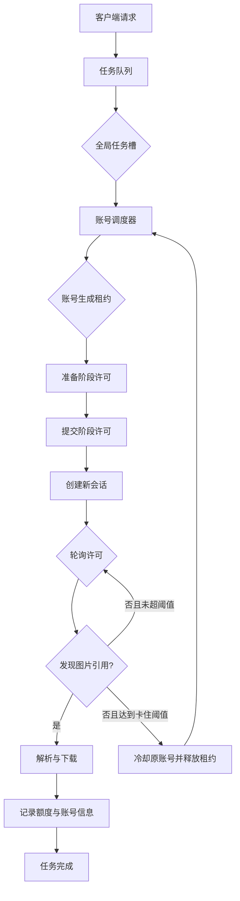

# IMAGE POOL 稳定号池并发设计 v1

## 1. 目标

这套设计面向高峰突发请求，核心目标是：

- 任务进入统一队列，入口流量与上游实际处理能力解耦。
- 全局并发、单账号并发、准备并发、提交并发、轮询并发分别设上限。
- 每个任务记录实际使用过的账号、账号额度、尝试次数、会话和切号原因。
- 账号失效、限流、额度耗尽、上游长时间无图分别处理，故障只影响对应账号和当前尝试。
- 轮询卡住时允许新账号创建新会话重新提交，同时保留旧会话的诊断信息。
- 通过队列等待时间、账号租约、轮询状态和重试数据判断容量，而不是只看当前任务数量。

## 2. 当前实现基线

当前代码已经具备一部分基础能力：

- `internal/tasks/manager.go` 使用容量为 4096 的任务队列和 128 个异步执行槽；任务等待全局/账号租约时会释放本地执行槽，拿到资源前再重新占用。
- `internal/accounts/accounts.go` 使用 `imageLeases[token]` 记录账号租约，并支持 `image_account_max_inflight_per_account`。
- 单号槽位支持 `image_account_dynamic_slots`：默认动态模式从 1 个槽位按健康度扩容并在异常后降级；静态模式直接使用单号最大并发上限。
- 账号选择已经考虑账号状态、冷却时间、当前租约数和最近使用时间。
- `internal/openaiweb/client.go` 已有参考图上传槽位，默认 12 个。
- `internal/openaiweb/conversation.go` 已有自适应轮询间隔，轮询预算为 600 秒。
- `internal/tasks/manager.go` 已有 `UsedAccounts`、`AvailableQuota` 和每次尝试统计。

当前链路的主要瓶颈在于：

1. 任务在账号租约和全局槽位都不足时需要等待唤醒；当前通过释放本地执行槽避免等待任务阻塞实际执行容量。
2. 一个账号尝试把上传、准备、提交、轮询和结果下载放在同一条调用链中，轮询阶段没有独立的全局上限。
3. 账号尝试使用任务级上下文。首个会话等待接近 600 秒后，任务剩余时间不足，新账号很难完成一次完整的新提交。
4. `polling_image` 目前主要表达“仍在等待”，缺少最后 HTTP 状态、轮询次数、连续空结果时长和切号原因。

## 3. 并发模型

把一次生图拆成四类资源：

| 资源 | 作用 | 生命周期 |
| --- | --- | --- |
| 全局任务槽 | 限制同时进入生图调度的任务数 | 从任务开始到任务结束 |
| 账号生成租约 | 限制同一个账号同时承担的生成尝试数 | 从准备开始到该尝试结束 |
| 阶段许可 | 限制上传、准备、提交、下载等瞬时压力 | 仅覆盖对应阶段 |
| 轮询许可 | 限制同时请求会话状态的数量 | 每次轮询请求短时占用 |

账号生成租约贯穿一次尝试的完整生命周期。轮询许可只限制某一刻的 HTTP 轮询请求，因此账号可以保持生成租约，同时让进程整体控制轮询请求峰值。



## 4. 首轮并发参数

以当前约 45 个可调度账号、单账号理论槽位约 225 个为起点，首轮压测参数建议如下：

```text
image_global_max_inflight              = 120
image_account_max_inflight_per_account = 1
image_account_dynamic_slots            = true
image_prepare_parallel                 = 20
image_submit_parallel                  = 20
image_poll_parallel                    = 80
image_download_parallel                = 20
image_upload_parallel                  = 12
image_queue_limit                      = 4096
image_stall_timeout_secs               = 150
image_poll_timeout_secs                = 600
image_task_timeout_secs                = 630
max_image_attempts                     = 3
image_max_switches_per_task            = 2
```

参数含义：

- `120` 是全局稳定工作上限，入口可以继续接收任务，超出部分留在队列中。
- 单账号默认使用 `1`，让账号池承担横向并发；如压测确认上游稳定，再逐步提高该值。直接设置为 `10` 会把账号内部的上传、会话和轮询压力叠加在一起。
- 动态模式会按账号健康度逐步扩容，静态模式会让每个可调度账号直接使用 `image_account_max_inflight_per_account`；两种模式都继续执行账号失效、限流和额度耗尽处理。
- 提交阶段设置为 `20`，避免大量账号同时进行浏览器初始化、Sentinel 和会话创建。
- 轮询阶段设置为 `80`，每个请求仍受 20 秒请求级超时约束，整体轮询预算仍由任务控制。
- `150` 秒是“没有图片引用”的切号阈值，不是所有任务的固定等待时间。正常任务在发现引用后继续执行解析和下载。
- 单个任务最多使用 3 次账号尝试，其中卡住切号最多 2 次，避免重复提交造成额度浪费。

最终值根据以下指标调节：成功率、P95/P99 完成时间、排队时间、429 数量、`conversation_inaccessible` 数量、卡住切号后的重复额度消耗。

## 5. 账号调度与租约

### 5.1 账号状态

调度器把账号分成以下状态：

```text
dispatchable  可调度
leased         已达到部分并发，占用租约
saturated      已达到单账号上限
cooling        临时冷却
invalid        凭证失效
quota_empty    图片额度耗尽
recovering     凭证恢复中
disabled       手工停用
```

冷却只影响新任务选号。已经持有租约的其他任务继续使用原账号，直到各自尝试结束。成功完成后清理该账号的临时失败计数和冷却信息。

### 5.2 选择规则

在 `Store` 内新增面向调度器的非阻塞租约接口：

```go
TryAcquireForImage(exclude map[string]bool) (Account, bool, error)
WaitForImageAvailability(ctx context.Context, exclude map[string]bool) error
ReleaseImage(token string)
MarkImageStalled(token string, err error) error
```

选择顺序：

1. 排除当前任务已经尝试过的账号。
2. 过滤凭证状态、额度状态和冷却状态。
3. 优先租约数较少的账号。
4. 在租约数相同的账号中，优先健康分高、最近较少使用的账号。
5. 额度已知时优先剩余额度较高的账号；额度未知账号保留调度资格，但降低优先级。

调度器拿不到账号时，任务回到“等待账号”状态，释放全局任务槽，由队列唤醒机制在账号释放、冷却结束或新账号加入时重新尝试。

## 6. 一次尝试的状态机

```text
queued
  -> waiting_account
  -> preparing
  -> submitting
  -> polling_image
  -> resolving_image
  -> succeeded
```

异常路径：

```text
preparing/submitting 认证失效       -> 移除账号 -> 新账号重试
preparing/submitting 429            -> 账号冷却 -> 新账号重试
preparing/submitting 5xx/网络异常   -> 指数冷却 -> 新账号重试
polling 终止状态                    -> 账号冷却 -> 新账号重试
polling 150 秒无图片引用            -> 标记 stalled -> 新账号新会话
内容限制                            -> 任务结束
任务上下文取消                      -> 任务结束并释放租约
```

每次尝试都创建独立的 `attemptCtx`，并记录 `attemptID`。原会话被取消后，即使上游晚到的响应仍返回，也通过 `attemptID` 丢弃过期进度，避免覆盖新账号的任务状态。

## 7. 卡住切号流程

进入 `polling_image` 后，连续 150 秒没有发现新的图片引用时：

1. 记录 `generation_stalled`。
2. 取消当前尝试的轮询和会话上下文。
3. 对原账号执行一次临时冷却，初始 90 秒，后续按失败次数指数增加。
4. 释放原账号生成租约。
5. 把原账号加入当前任务排除集合。
6. 新账号重新上传参考图。
7. 新建 `conversation_id` 并重新提交。
8. 继续写入同一个任务的 `UsedAccounts` 和 `AttemptLog`。

新账号只能创建新会话，原会话的 `conversation_id` 只用于诊断和后台追踪。由于原会话可能已经在上游继续生成，切号阈值需要保守起步；首轮采用 150 秒，结合 1 次到 2 次切号上限。

## 8. 任务中的账号信息

现有 `Task.UsedAccounts` 已适合作为任务级账号轨迹，继续保留以下字段：

```json
{
  "id": "ACCOUNT_ID",
  "email": "ACCOUNT_EMAIL",
  "available_quota": 3,
  "status": "success",
  "attempts": 1,
  "removed": false,
  "error": ""
}
```

`AttemptLog` 增加诊断字段：

```go
type AttemptLog struct {
    Attempt          int
    AccountID        string
    AccountEmail     string
    ConversationID   string
    Status           string
    Phase            string
    PollCount        int
    LastHTTPStatus   int
    EmptyResultSecs  int
    SwitchReason     string
    CooldownUntil    string
    StartedAt        time.Time
    FinishedAt       time.Time
}
```

后台任务列表显示账号邮箱、当前额度、尝试次数和切号原因；敏感凭证继续留在服务端内部结构中，不进入任务响应和日志。

## 9. 代码落点

| 模块 | 设计改动 |
| --- | --- |
| `internal/config/config.go` | 增加全局任务槽、准备/提交/轮询/下载并发、卡住阈值、切号次数和冷却参数 |
| `internal/accounts/accounts.go` | 将账号租约封装为带尝试 ID 的租约；增加非阻塞获取、释放、卡住标记和调度快照 |
| `internal/images/service.go` | 把任务级调度与账号级尝试分开；每次重试创建独立上下文；统一写入尝试诊断 |
| `internal/openaiweb/client.go` | 将上传、准备、提交、下载接入阶段许可；保留客户端内部的请求级超时 |
| `internal/openaiweb/conversation.go` | 统计轮询次数、最后状态和空结果时长；达到阈值返回独立的 `ErrImageGenerationStalled` |
| `internal/tasks/manager.go` | 等待账号/全局槽位时释放 worker 资源；保留队列状态和账号轨迹；扩充容量统计 |
| `internal/httpapi/image_pool_capacity.go` | 暴露各阶段当前使用量、等待量、冷却量、卡住切号数和建议容量 |
| `web/src/app/tasks/page.tsx` | 在任务详情显示账号、额度、尝试、阶段、轮询和切号原因 |

## 10. 落地顺序

### 阶段 A：诊断字段

先增加轮询计数、HTTP 状态、空结果时长、会话 ID、账号租约和切号原因，保持现有调度行为。通过日志确认卡住类型分布。

### 阶段 B：分层并发

增加全局任务槽、准备槽、提交槽、轮询槽和下载槽。账号租约仍贯穿完整尝试，等待账号的任务回到队列，不占用执行 worker。

### 阶段 C：卡住切号

新增 `ErrImageGenerationStalled`，实现 150 秒阈值、账号冷却、任务排除账号、新会话重提和最多 2 次切号。

### 阶段 D：容量面板

容量接口显示：

```text
queue_depth
global_inflight
prepare_inflight
submit_inflight
poll_inflight
download_inflight
dispatchable_accounts
leased_accounts
cooling_accounts
stalled_attempts
account_slots
```

### 阶段 E：压测与参数定型

按 50、100、120、150 并发逐级压测，每档观察至少 15 分钟，记录：

- 成功率和失败分类；
- P50/P95/P99 完成时间；
- 队列等待时间；
- 每个账号的最大租约数；
- 429、401、5xx、`conversation_inaccessible` 数量；
- 卡住切号次数和重复额度消耗；
- 轮询请求峰值和平均请求间隔。

## 11. 验收标准

1. 单账号实际租约数始终不超过配置值。
2. 全局生成尝试数始终不超过全局任务槽。
3. 提交并发和轮询并发分别受到独立上限约束。
4. 账号池繁忙时，任务留在队列等待，执行 worker 保持可用。
5. 连续 150 秒无图片引用的尝试进入 `generation_stalled`，随后按规则切换新账号和新会话。
6. 同一任务的账号列表、额度和每次尝试信息完整可追踪。
7. 任务完成后租约、阶段许可和上下文全部释放。
8. 取消、超时、上游异常和服务停止场景都能释放资源，不产生永久占用。
